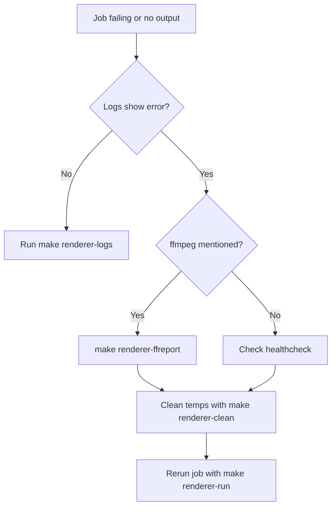

# Renderer Runbook

This guide helps operators and new teammates monitor, troubleshoot, and rerun jobs for the video renderer.

## Logs
- Follow renderer logs:
  ```bash
  make renderer-logs
  ```
- Renderer emits structured JSON in the container stdout.

## FFREPORT
When `DEBUG=true`, ffmpeg writes a detailed log to `/tmp/ffreport-<job_id>.log`.
- Tail the latest FFREPORT for a job:
  ```bash
  make renderer-ffreport JOB=<job_id>
  ```

## Rerun a Single Job
1. Gather the job ID, story ID, part ID, and frames directory.
2. Run the job directly:
   ```bash
   make renderer-run JOB=<job_id> STORY=<story_id> PART=<part_id> FRAMES=<frames_dir>
   ```

## Error Handling
- Inspect logs for `error` events.
- If ffmpeg failed, check the corresponding FFREPORT.
- Clean temporary work directories after failures:
  ```bash
  make renderer-clean
  ```

## Log Locations
- Renderer container stdout: `make renderer-logs`
- Temporary files per job: `${TMP_DIR}/<job_id>`
- FFREPORT diagnostics: `/tmp/ffreport-<job_id>.log`

## Healthcheck
The renderer's Docker healthcheck verifies:
1. The API responds to `/healthz`.
2. `/tmp/renderer/worker_heartbeat` is updated within 60 seconds.

## Troubleshooting Flowchart


## Fixture Rendering
To verify setup, render the sample fixture:
```bash
uv run --with httpx python video_renderer/create_slideshow.py \
  --job-id job1 --story-id story --part-id p1 \
  --frames-dir /tmp/runbook_demo/frames --debug
```
This produces `/tmp/runbook_demo/output/story_p1.mp4` using generated frames and audio.
